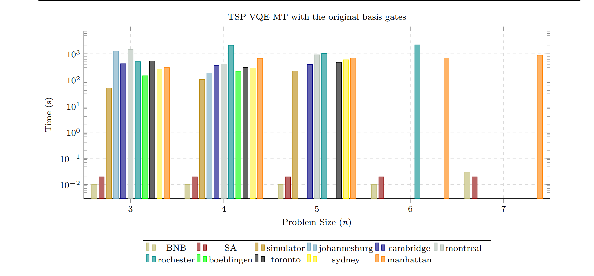
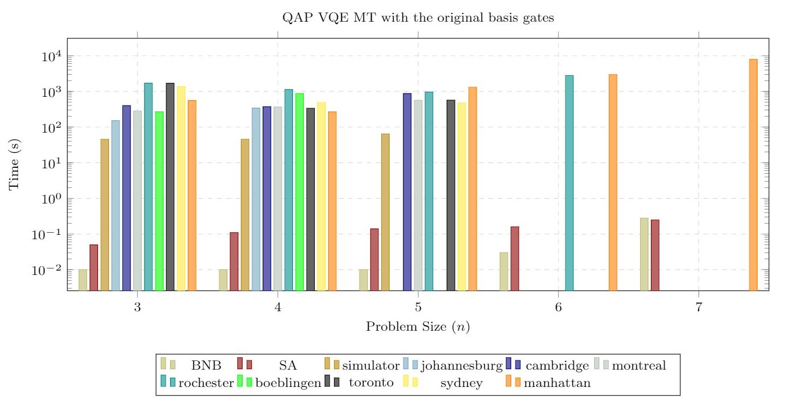

# Solving Combinatorial Optimisation Problems (COP) Using Quantum Algorithms 

The COP solved in this research are the Travelling Salesman Problem (TSP) and the Quadratic Assignment Problem (QAP). This repository contains the experimental code, input data and results obtained for the TSP and the QAP using the solution techniques:
- Variational Qauantum Eigensolver (VQE)
- Quantum Approximation Optimisation Algorithm (QAOA)

which are documented in the conference proceedings titled [On the Computational Performance of IBM Quantum Devices Applied to Combinatorial Optimisation Problems](https://ieeexplore.ieee.org/abstract/document/9311605) and the preprint titled [An investigation of IBM Quantum Computing device performance on Combinatorial Optimisation Problems
](https://arxiv.org/abs/2107.03638).
These methods were applied to the COP and executed on the IBM quantum devices. 

## Repository Details
**Code**
- This folder contains the Jupyter Notebooks which apply the two solution techniques VQE and QAOA to the COP.

**Data**
- This folder contains the corresponding COP datasets
- For the TSP: 
    - The 'Matrices.txt' file contains all the matrices that are used in the VQE and the QAOA. The readInData() function reads the .txt file and outputs an array corresponding to each matrix.  
    - These dataset follow the [TSPLIB](http://elib.zib.de/pub/mp-testdata/tsp/tsplib/tsp/index.html) formatting convension. Furthermore, these datasets were randomly generated.
    - The 'optimal.txt' file contains the initial starting point corresponding to the matrices used in the VQE and QAOA. The optimal() function reads the .txt file and outputs an array that corresponds to each initial point of each matrix. 
- For the QAP:
    - The datasets labelled "made#.csv" are randomly generated QAP instances, and the number correlates to the number of facilities in the problem (the dimensions of the two matrices in the CSV file). The format of the CSV files follows that of the datasets available in [QAPLIB](https://www.opt.math.tugraz.at/qaplib/).
    - The datasets in the VQE and QAOA folders are the initial points used in the warm start approach taken in the papers listed. Each initial point corresponds to the QAP instance of the same size referenced in the name.

**Results**
- This folder contains the results obtained to the COP using the VQE and the QAOA. 
- The experimental results (found in detail in the below-listed papers) show that classical benchmarks have the best results in terms of success rate, feasibility and computational time on both COP. VQE performs better than QAOA on the small number of instances tested on all the metrics used.
- Classical algorithms perform better than the VQE in terms of computational time. The figure below illustrates that the performance of the various employed quantum devices are consistent in terms of computational time, with the simulator performing the best. There is no distinct correlation between problem size and computational time for quantum devices. However, this claim is made with a limited number of problem instances.
- Noisy intermediate-scale quantum (NISQ) devices' low reliability is attributed to the high variability in physical characteristics such as error rates and coherence time. These attributes substantiate why there lacks a distinct relationship between the problem size and the computational time required to find a solution using the VQE algorithm.

## Findings
The results show the limitations of NISQ devices, given that the classical optimisation techniques perform significantly better in terms of computational time, success rate, feasibility and uncertainty percentage. Furthermore, given the limited number of available qubits and limitations in circuit size - the practical use of NISQ devices in this class of problem is still in its infancy. VQE and QAOA performed similarly in terms of success rate, feasibility and uncertainty percentage. However, QAOA is limited to fewer instances and has a longer computational time than VQE. The performance of NISQ devices could prospectively improve in the future as quantum technology evolves. The introduction of the conditional reset feature with new basis gates did not show improvement in any metrics. In future work, other available formulations - such as QUBO and ADMM- could be investigated. The promise of IBM's devices with higher-performing processors and more qubits provides hope for higher quality solutions for COP.

## Qiskit
[Qiskit](https://qiskit.org/) is an open source software development kit (SDK) for working with OpenQASM and the IBM Q quantum processors.
### How to install Qiskit
Details on the installation of Qiskit can be found [here](https://qiskit.org/documentation/getting_started.html).

## Acknowledgement
The authors of this research acknowledge the [University of the Witwatersrand, Johannesburg](https://www.wits.ac.za/) contribution through its support and Quantum Computing resources, which made this research possible. We acknowledge the use of IBM Quantum services for this work. The views expressed are those of the authors and do not reflect the official policy or position of IBM or the IBM Quantum team.

## Citations
@inproceedings{chieza2020computational,
  title={On the Computational Performance of IBM Quantum Devices Applied to Combinatorial Optimisation Problems},
  author={Chieza, HA and Khumalo, MT and Prag, K and Woolway, M},
  booktitle={2020 7th International Conference on Soft Computing \& Machine Intelligence (ISCMI)},
  pages={260--264},
  year={2020},
  organization={IEEE}
}

@article{khumalo2021investigation,
  title={An investigation of IBM Quantum Computing deviceperformance on Combinatorial Optimisation Problems},
  author={Khumalo, Maxine T and Chieza, Hazel A and Prag, Krupa and Woolway, Matthew},
  journal={arXiv preprint arXiv:2107.03638},
  year={2021}
}

